# PropProfessor MCP

> An MCP server that shows you what the sharp money is doing. 25 tools that screen 36 sportsbooks, detect sharp movement, surface line moves, and explain the consensus — so you can decide what to bet, not be told.

[](https://github.com/j17drake/propprofessor-mcp/releases)
[](https://github.com/j17drake/propprofessor-mcp/actions/workflows/ci.yml)
[](https://github.com/j17drake/propprofessor-mcp/actions/workflows/ci.yml)
[](https://github.com/j17drake/propprofessor-mcp/actions/workflows/ci.yml)
[](https://img.shields.io/badge/node-18%2B-44cc11)
[](LICENSE)

Connect it to Claude Desktop, Cursor, Cline, or any MCP client. Your agent gets 27 tools to screen odds across 36 books, detect coordinated sharp movement, surface steam moves and line lags, and explain why a play is being flagged — all backed by the actual data, not a black-box prediction. It needs a [PropProfessor](https://propprofessor.com) account to work.

---

## ⚡ Quickstart — for agents and end users

**The simplest flow.** Your agent calls the `ask` tool to parse your query, then calls the suggested tool:

```
You:  "Tell me the best plays today available on Fliff"
Agent: ask({ query: "best plays today on Fliff" })
       → { parsed: { book: "Fliff" }, suggestedTool: "quick_screen", suggestedArgs: { books: ["Fliff"] } }
Agent: quick_screen({ books: ["Fliff"] })
       → [ranked plays with odds, edge, tier, risk, rationale — all on Fliff]
```

**One sentence:** `ask` routes your natural language query → the right tool runs automatically. No need to know tool names, leagues, markets, or parameters.

| You say                   | `ask` calls                                            | Returns                           |
| ------------------------- | ------------------------------------------------------ | --------------------------------- |
| "best plays on Novig"     | `quick_screen(books=["NovigApp"])`                     | Playable bets with player context |
| "what should I bet today" | `recommended_bets()`                                   | TIER 1 & TIER 2 across 10 leagues |
| "Tatum over 29.5 points"  | `player_context(player="Tatum", sport="NBA")`          | Injury/news risk check            |
| "show me MLB sharp plays" | `sharp_plays(leagues=["MLB"])`                         | Multi-sharp consensus plays       |
| "line shop Celtics ML"    | `find_best_price(league="NBA", market="Moneyline", …)` | Best price across 36 books        |

Agents that load the `propprofessor-coach` skill get automatic routing. End users get a [CLI](#install-one-command) too: `pp-query`.

---

**Honest scope:** PropProfessor MCP is a **sharp-money signal feed**, not a betting oracle. The ranking pipeline reliably detects _what sharp books are doing_ (line moves, consensus, steam, independent sharp confirmation) — it does **not** reliably predict _which side will win_. The TIER 1/2/3/4 system is a quality rating on the signal strength, not a confidence claim about outcomes. Use it as a tool to inform your own handicapping, not to outsource your decisions.

---

## See it in action

Ask your agent: _"Show me the strongest coordinated sharp-money signals on tonight's NBA slate."_

```json
{
  "ok": true,
  "result": {
    "plays": [
      {
        "tier": "TIER 1",
        "kaiCall": "BET",
        "game": "Lakers @ Celtics",
        "market": "Moneyline",
        "selection": "Lakers ML",
        "odds": -135,
        "edge": 4.2,
        "riskScore": 1.8,
        "rationale": "Pinnacle + Circa both moved -142 → -135 over 90 min. Steam confirmed on 3 books. 5+ book consensus. No injury flag."
      },
      {
        "tier": "TIER 2",
        "kaiCall": "CONSIDER",
        "game": "Warriors @ Nuggets",
        "market": "Spread",
        "selection": "Warriors +3.5",
        "odds": -110,
        "edge": 2.1,
        "riskScore": 3.4,
        "rationale": "Single-window sharp move on DraftKings. Modest consensus. Player context clean."
      }
    ],
    "marketsBreakdown": { "Moneyline": 3, "Spread": 1, "Total": 0 }
  },
  "resultMeta": {
    "tierCounts": { "TIER 1": 1, "TIER 2": 1, "TIER 3": 0, "TIER 4": 0 }
  }
}
```

That's the output your agent gets. The `tier` is the **signal quality rating** (1 = highest signal strength, 4 = no real signal). The `riskScore` is 1–10 (lower = cleaner). The `rationale` tells you _what sharp books are doing_ — not what will happen. The `kaiCall` and tier are quality assessments of the movement data, not predictions about outcomes. Use them to decide what to investigate further; the call on whether to act is yours.

---

## The numbers

Tier ordering validated against synthetic and real-world snapshots. TIER 1 hit rate ~50% (system flags real movement but doesn't beat chance on outcomes — by design, it measures signal quality, not predictive power). 924 tests, 82% coverage. Full validation table in [docs/METHODOLOGY.md](docs/METHODOLOGY.md).

### How it fits together

```mermaid
flowchart LR
    subgraph BOOKS["36 sportsbooks"]
        B1[Pinnacle]
        B2[Circa]
        B3[BookMaker]
        B4[BetOnline]
        B5[NoVigApp]
        B6[Fliff]
        BN[...30 more]
    end

    API[PropProfessor API]

    subgraph PIPE["Ranking pipeline"]
        E[Extract odds]
        H[Hydrate with line history]
        R[Rank by movement + consensus]
        T[Tier + risk score]
    end

    subgraph OUTPUT["27 tools exposed via MCP"]
        RB[recommended_bets]
        SP[sharp_plays]
        SC[sharp_consensus]
        SR[screen_ranked]
        OTH[...24 more]
    end

    CLIENT[Your AI agent<br/>Claude / Cursor / Cline / Hermes]

    BOOKS --> API --> PIPE --> OUTPUT --> CLIENT
    CLIENT -. "you decide what to bet" .- BOOKS
```



The pipeline is the _honest_ middle layer — it does one job well (detect what sharp books are doing) and surfaces it via 27 tools. The betting decision stays with the human.

---

## What you can ask your agent

- "Tell me the best plays on Fliff tonight" → `ask` + `quick_screen`
- "What should I bet today" → `recommended_bets`
- "Sharp consensus on the Lakers game" → `sharp_consensus`
- "Best price for Celtics ML" → `find_best_price`
- "Any injury flags on Tatum" → `player_context`
- "Log this pick — Warriors +3.5 at -110" → `log_pick`

Full prompt catalog in [docs/AGENT_PROMPT.md](docs/AGENT_PROMPT.md).

---

## Install (one command)

**The new flow (Hermes users):**

```bash
git clone https://github.com/j17drake/propprofessor-mcp.git
cd propprofessor-mcp
npm install
npm link
make install             # links the coach skill, wires the MCP server, installs default config
pp-query login           # opens a browser, log into PropProfessor
pp-query doctor          # confirms everything's wired up
```

**What `make install` does:**

1. Links the `propprofessor-coach` skill into `~/.hermes/skills/`
2. Registers the MCP server with hermes (idempotent)
3. Installs the default config to `~/.propprofessor/config.json`

**Optional:** install the sharp-money alert cron (runs hourly, delivers TIER 1 plays to your home telegram channel):

```bash
make install-cron
```

**Traditional flow (non-Hermes or manual):**

```bash
git clone https://github.com/j17drake/propprofessor-mcp.git
cd propprofessor-mcp
npm install
npm link
pp-query login       # opens a browser, log into PropProfessor
pp-query doctor     # confirms everything's wired up
```

You now have two commands:

|| Command | Purpose |
|| ---------- | --------------------------------------------------- |
|| `pp-mcp` | MCP server (stdio) — what your AI agent connects to |
|| `pp-query` | CLI for setup, debug, quick checks |

**Requirements:** Node 18+, a paid [PropProfessor](https://propprofessor.com) account, ~5 minutes. Full walkthrough in [SETUP.md](SETUP.md).

---

## MCP client setup

### Hermes Agent

```yaml
mcp_servers:
  propprofessor:
    command: node
    args:
      - /path/to/propprofessor-mcp/scripts/propprofessor-mcp-server.js
    enabled: true
    env:
      AUTH_FILE: /path/to/.propprofessor/auth.json
      PROPPROFESSOR_MCP_NDJSON: 'true'
```

### Claude Desktop / Cursor / Cline / Zed

```json
{
  "mcpServers": {
    "propprofessor": {
      "command": "node",
      "args": ["/path/to/propprofessor-mcp/scripts/propprofessor-mcp-server.js"],
      "env": {
        "AUTH_FILE": "/path/to/.propprofessor/auth.json",
        "PROPPROFESSOR_MCP_NDJSON": "true"
      }
    }
  }
}
```

Replace the path with wherever you cloned the repo. Token compression (smaller context for large responses) — install `caveman-shrink` globally and use `command: caveman-shrink` with `node` + server path in `args`.

---

## All 27 tools (reference)

### For quick situational checks (the 5-minute scan)

|| Tool | What it does |
|| ---------------------------------------- | --------------------------------------------------------- |
|| `ask` | Parse natural language queries — "best plays on Fliff" → the right tool |
|| `quick_screen` | Best plays on any book with sharp consensus + player context (default: NoVigApp) |
|| `get_started(user_type: "casual")` | Returns the casual workflow (3 tools) |
|| `recommended_bets(verbosity: "minimal")` | Top flagged movements in plain English |
|| `player_context` | Injury/availability check on specific plays |
|| `get_pick_stats` | Your win rate + P&L (only meaningful if you've logged picks) |
|| `log_pick` / `resolve_pick` | Track your own bet outcomes (optional) |
|| `health_status` | "Is the system up?" |

### For deeper signal analysis (what sharp books are doing)

Everything in casual, plus:

|| Tool | What it does |
|| ------------------------------------------------------------------- | ----------------------------------------------------------------- |
|| `recommended_bets(verbosity: "standard")` | Flagged plays with tier, risk score, movement rationale |
|| `find_best_price` | Line-shop across all books for the best price |
|| `league_presets` | Sport-specific ranking weights |
|| `novig_screen` | NoVigApp-specific screen (delegates to `quick_screen`) |
|| `quick_screen` | Best plays on any book with sharp consensus + player context |
|| `validate_play` | One-call validation: re-fetches the play, runs player_context for injury news, checks execution quality, returns a single BET/CONSIDER/PASS verdict with all evidence |
|| `manage_hidden_bets` | Manage flagged-play visibility (action=list/hide/unhide/clear) |
|| `get_pick_history` | View logged picks |

### For full raw data and research (complete control over the signal)

Everything above, plus:

|| Tool | What it does |
|| ---------------------------------- | --------------------------------------------------------------------------------------- |
|| `screen_ranked(verbosity: "full")` | Complete ranked data with movement signals |
|| `sharp_consensus` | Multi-window sharp movement (1h–48h) |
|| `sharp_plays` | Plays with **independent sharp confirmation** across Pinnacle/Circa/BookMaker/BetOnline |
|| `get_play_details` | Line history for specific games |
|| `staking_plan` | Fractional Kelly sizing for picks you decide to place (TIER 1: 2%, TIER 2: 1% of bankroll) |
|| `ev_candidates` | Fast +EV discovery (validate on `/screen` after) |
|| `all_slates` | Consolidated ranked list across multiple leagues |
|| `fantasy_optimizer` | DFS-style fantasy picks from PrizePicks, Underdog, etc. (requires Fantasy Optimizer subscription) |
|| `screen` | League-specific screen (NBA, MLB, NHL, NFL, WNBA, UFC, Tennis, Soccer, NCAAB, NCAAF) |
|| `get_alerts` | Line movement alerts |

### Tool guide by category

|| Category | Tools |
|| ----------------------- | ----------------------------------------------------------- | ------------------------------------------------------------------------------------------------------ |
|| **Screening & Ranking** | `screen_ranked`, `screen`, `all_slates`, `get_play_details` |
|| | **Sharp Movement** | `sharp_plays`, `sharp_consensus` |
|| **Flagged Plays** | `recommended_bets`, `staking_plan`, `ev_candidates` |
|| **Line Shopping** | `find_best_price` |
|| **Player Context** | `player_context` |
|| **Validation** | `validate_play` |
|| **Fantasy Optimizer** | `fantasy_optimizer` |
|| **UFC** | `ufc_card` |
|| **Bet Management** | `manage_hidden_bets` |
|| **Picks & Tracking** | `log_pick`, `resolve_pick`, `get_pick_history`, `get_pick_stats`, `get_alerts`, `clear_score_timeline` |
|| **Meta** | `get_started`, `health_status`, `league_presets` |

Every tool accepts a `verbosity` param (`"minimal"` / `"standard"` / `"full"`) and a `compact: true` flag to shrink responses by ~90%. See [docs/PERFORMANCE.md](docs/PERFORMANCE.md) for response-size tuning.

---

## How the ranking works

The pipeline runs in 5 steps for every play: **grade the movement** (green/yellow/red), **score the risk** (1–10 from weighted factors), **assign the tier** (lookup table), **apply hysteresis** (prevent tier thrashing on small odds moves), **cross-reference sharp books** (verify target-book moves independently). The returned tier + kaiCall are quality ratings on the signal, not predictions.

Full math, weight tables, and the tier assignment lookup in [docs/METHODOLOGY.md](docs/METHODOLOGY.md).

---

## Backtesting

Validated via synthetic scenarios (sharp_move, stable_no_edge, adverse) and daily snapshots of pre-game odds. Run: `node scripts/backtest-synthetic.js`. See [docs/BACKTESTING.md](docs/BACKTESTING.md).

---

## FAQ

**Does this tell me what to bet?** No. PropProfessor MCP surfaces _what sharp books are doing_ — line moves, consensus, steam, line lag. It does not predict outcomes. TIER 1 hit rate sits around chance (~50%).

**Do I need a PropProfessor account?** Yes. Live data requires a paid subscription at [propprofessor.com](https://propprofessor.com).

**What books does it cover?** 36 sportsbooks across 10 leagues. Sharp cross-reference: Pinnacle, Circa, BookMaker, BetOnline.

**Is it free?** Code is MIT-licensed. Data requires a paid PropProfessor subscription. No "Pro tier" of the MCP itself.

**Can I run it without an MCP client?** Yes — `pp-query` is a standalone CLI.

**What if I find a bug?** Run `pp-query doctor` first, then [open a GitHub issue](https://github.com/j17drake/propprofessor-mcp/issues).

---

## Status

**Actively maintained.** Latest: v2.2.0 (27 tools). CI: [](https://github.com/j17drake/propprofessor-mcp/actions/workflows/ci.yml). Nightly live-smoke validates end-to-end against the real API. Run `pp-query doctor` for diagnostics.

---

## Support this project

This is a free, MIT-licensed MCP. If it saves you time or makes you money, consider:

- ⭐ Star the repo — helps others find it
- 🐛 [Open an issue](https://github.com/j17drake/propprofessor-mcp/issues) when you find a bug
- 💸 [Sponsor on GitHub](https://github.com/sponsors/j17drake) — funds ongoing development

No paid tier. No upsell. The whole codebase is open and the priority is making it better for the people who use it.

---

## For maintainers

- **Tests**: `npm test` (924 passing) — 5/5 reruns, deterministic
- **Coverage**: `npm run test:coverage` (~82% statements, ~88% functions)
- **Lint**: `npm run lint` (clean)
- **Format**: `npm run format:check` (clean — `npm run format` to fix)
- **Version check**: `npm run check:version` (verifies package.json ↔ CHANGELOG consistency)
- **Live smoke**: `npm run smoke:live` (requires `auth.json`)
- **Release**: Push a `v*` tag → GitHub Actions runs lint + tests on Node 20 + 22, then auto-creates the GitHub release
- **Changelog**: [CHANGELOG.md](CHANGELOG.md)
- **Tool definitions**: `lib/propprofessor-tool-definitions.js`
- **Tier methodology**: `lib/propprofessor-risk-score.js`
- **Ranking logic**: `lib/screen-ranker.js`

Detailed docs:

- [SETUP.md](SETUP.md) — install, auth, MCP client configs, troubleshooting
- [AUTH.md](AUTH.md) — auth flow, file locations, session management
- [CONFIG.md](CONFIG.md) — env vars, book configuration
- [CONTRIBUTING.md](CONTRIBUTING.md) — how to add a tool, PR conventions
- [SECURITY.md](SECURITY.md) — auth handling, threat model
- [MAINTAINERS.md](MAINTAINERS.md) — release process, code ownership
- [docs/METHODOLOGY.md](docs/METHODOLOGY.md) — full ranking methodology (movement grading, risk score weights, tier table)
- [docs/BACKTESTING.md](docs/BACKTESTING.md) — tier validation methodology
- [docs/MARKET-BOOK-AVAILABILITY.md](docs/MARKET-BOOK-AVAILABILITY.md) — which books post which markets
- [docs/HERMES_SKILL.md](docs/HERMES_SKILL.md) — Hermes skill for this MCP
- [docs/AGENT_PROMPT.md](docs/AGENT_PROMPT.md) — system prompt template for agents

---

## License

[MIT](LICENSE) — see LICENSE for the full text. PropProfessor is a paid service; this MCP is an unofficial client built by [j17drake](https://github.com/j17drake), not affiliated with PropProfessor.

---

## What's new (v2.2.0)

- **`ask` tool** — natural language query parser. Agents call `ask({ query: "best plays on Fliff" })` and get back `{ book: "Fliff", suggestedTool: "quick_screen", suggestedArgs: {...} }`. Agents route queries without knowing tool names.
- **`quick_screen` tool** — generalised `novig_screen` that accepts any `books` param. `quick_screen({ books: ["Fliff"] })` runs sharp_plays + player_context for any target book. `novig_screen` now delegates to `quick_screen` for backward compatibility.
- **`book` field on `recommended_bets`** — each play now includes the execution book (from the user's `books` param). `focusBook` surfaced at the top level. Agents can now answer "what's on Fliff" from `recommended_bets`.
- 27 total tools (was 25, +`ask` + `quick_screen`)

See [docs/RELEASES.md](docs/RELEASES.md) for full release history.
