# PropProfessor MCP ── Sharp Money Intelligence for AI Agents

<p align="center">
  <a href="https://github.com/j17drake/propprofessor-mcp/releases">
    
  </a>
  <a href="https://github.com/j17drake/propprofessor-mcp/actions/workflows/ci.yml">
    
  </a>
  
  
  
  <a href="LICENSE">
    
  </a>
</p>

PropProfessor MCP is a Model Context Protocol server that lets AI agents see what the sharpest sportsbooks are doing. It screens 36 books across 10 leagues, detects coordinated sharp movement, surfaces steam moves and line lags, and explains the consensus — so you can decide what to bet, not be told.

Connect it to Claude Desktop, Cursor, Cline, Hermes, or any MCP client. Requires a [PropProfessor](https://propprofessor.com) account.

> **Honest scope:** This is a **sharp-money signal feed**, not a betting oracle. The ranking pipeline detects _what sharp books are doing_ — it does **not** predict outcomes. TIER 1 hit rate sits around chance (~50%). Use it to inform your own handicapping, not to outsource decisions.

## 🚀 Overview

Your AI agent gets 29 tools that surface the same signal feed professional bettors use:

- **Screen & rank** — query live odds across 36 sportsbooks, ranked by consensus edge and movement
- **Detect sharp coordination** — Pinnacle, Circa, BookMaker, and BetOnline moving together? That's a signal
- **Explain the "why"** — every play comes with a human-readable rationale: _what moved, on which books, over what timeframe_
- **Natural language routing** — agents call `ask("best plays on Fliff tonight")` and get routed to the right tool automatically

The pipeline extracts odds, hydrates line history, ranks by movement quality + consensus strength, assigns a tier and risk score, and returns everything your agent needs to present an informed recommendation. The betting decision stays with the human.

## 🏛 Architecture

PropProfessor MCP follows a layered data pipeline:

### API Layer

- **PropProfessor Backend** — authenticated REST API for live odds, line history, and fantasy data
- **ESPN Integration** — live scores for tennis time correction and game verification
- **X / Google News** — player context (injury news, tweets) for bet validation

### Ranking Pipeline (Node.js)

- **Extract** — parse raw odds payloads from the screen API, expand multi-book selections
- **Hydrate** — enrich each row with 12-hour odds history via the backend API (cached cross-call with 5-min TTL)
- **Rank** — score by consensus edge (% advantage over sharp consensus), CLV proxy (opening vs current line movement), and league-specific market priorities
- **Tier** — assign TIER 1–4 based on movement grade (green/yellow/red) × risk score (1–10) × sharp book confirmation, with hysteresis to prevent thrashing
- **Format** — output at three verbosity levels: `minimal` (plain English), `standard` (tier/edge/risk/rationale), `full` (raw movement data)

### MCP Server (stdio)

- **JSON-RPC over stdio** — standard MCP transport with Content-Length framing (NDJSON optional)
- **29 tools** — organized into situational, analytical, and research tiers
- **Server-side validation** — enforces input schemas at the server, not trusting the client
- **Categorized errors** — auth, backend, transport, validation, internal — each with structured recovery hints

### Data Flow

```mermaid
flowchart LR
    subgraph BOOKS["36 Sportsbooks"]
        B1[Pinnacle]
        B2[Circa]
        B3[BookMaker]
        B4[BetOnline]
        B5[NoVigApp]
        B6[Fliff]
        BN[...30 more]
    end

    API[PropProfessor API]

    subgraph PIPE["Ranking Pipeline"]
        E[Extract odds]
        H[Hydrate with line history]
        R[Rank by movement + consensus]
        T[Tier + risk score]
    end

    subgraph OUTPUT["29 MCP Tools"];
        RB[recommended_bets]
        SP[sharp_plays]
        SC[sharp_consensus]
        SR[screen_ranked]
        QS[quick_screen]
        SB[smart_bet]
        ASK[ask]
        OTH[...23 more]
    end

    CLIENT[Your AI Agent<br/>Claude / Cursor / Cline / Hermes]

    BOOKS --> API --> PIPE --> OUTPUT --> CLIENT
    CLIENT -. "you decide what to bet" .- BOOKS
```



## 🛠 Getting Started

### Quick Start

```bash
git clone https://github.com/j17drake/propprofessor-mcp.git
cd propprofessor-mcp
npm install
npm link
pp-query init          # auth + verification + config — all at once
```

`pp-query init` checks Node version, opens PropProfessor login if needed, runs `doctor`, and prints ready-to-paste MCP config for your client. Or do it step by step:

```bash
pp-query login         # browser login
pp-query doctor        # verify everything works
```

Requires a paid [PropProfessor](https://propprofessor.com) account. That's it — you're ready to connect your AI agent.

### MCP Client Setup

Add to your client's MCP config:

```json
{
  "mcpServers": {
    "propprofessor": {
      "command": "node",
      "args": ["/path/to/propprofessor-mcp/scripts/propprofessor-mcp-server.js"],
      "env": {
        "PROPPROFESSOR_MCP_NDJSON": "true",
        "AUTH_FILE": "/path/to/.propprofessor/auth.json"
      }
    }
  }
}
```

Replace `/path/to/` with your actual install path (e.g. `/Users/you/projects/propprofessor-mcp`). Supports Claude Desktop, Cursor, Cline, Zed, Continue.dev, Windsurf, and any other stdio-based MCP client. See each client's docs for where MCP config lives.

**For short-lived one-off sessions:**

```json
{ "command": "npx", "args": ["-y", "propprofessor-mcp"] }
```

Works out of the box — no git clone needed. Requires a PropProfessor account.

**For headless/CI environments (no Chrome):**

Set the `PROPPROFESSOR_COOKIES` env var with your PropProfessor cookies exported as JSON. This bypasses the CDP/Chrome auth path entirely:

```json
{
  "mcpServers": {
    "propprofessor": {
      "command": "npx",
      "args": ["-y", "propprofessor-mcp"],
      "env": {
        "PROPPROFESSOR_COOKIES": "[{\"name\":\"__Secure-next-auth.session-token\",\"value\":\"...\",\"domain\":\".propprofessor.com\"}]"
      }
    }
  }
}
```

### CLI Commands

| Command           | Purpose                                                 |
| ----------------- | ------------------------------------------------------- |
| `pp-mcp`          | MCP server (stdio) — what your AI agent connects to     |
| `pp-query init`   | One-command setup (Node check + auth + doctor + config) |
| `pp-query login`  | Browser login to PropProfessor                          |
| `pp-query doctor` | Full diagnostic check                                   |

### Hermes Agent

If you use [Hermes Agent](https://github.com/NousResearch/hermes-agent):

```bash
make install          # register MCP server + install default config
```

Or manually: add `propprofessor` to your `mcp_servers` in config.yaml. The `get_started` tool provides on-demand workflow guidance.

### Optional: Sharp-money alert cron

```bash
make install-cron
```

Runs hourly, delivers TIER 1 plays to your home Telegram channel.

### CLI commands

| Command           | Purpose                                             |
| ----------------- | --------------------------------------------------- |
| `pp-mcp`          | MCP server (stdio) — what your AI agent connects to |
| `pp-query`        | CLI for setup, debug, and quick one-off queries     |
| `pp-query login`  | Browser login to PropProfessor                      |
| `pp-query doctor` | Full diagnostic check                               |

## 🎯 The Natural Language Flow

Agents don't need to memorize tool names. Call `ask` to parse a user's query, then call the suggested tool:

```
You:  "Tell me the best plays on Fliff tonight"
Agent: ask({ query: "best plays on Fliff tonight" })
       → { parsed: { book: "Fliff" }, suggestedTool: "quick_screen", suggestedArgs: { books: ["Fliff"] } }
Agent: quick_screen({ books: ["Fliff"] })
       → [ranked plays with odds, edge, tier, risk, rationale — all on Fliff]
```

| You say                              | `ask` calls                                            | Returns                           |
| ------------------------------------ | ------------------------------------------------------ | --------------------------------- |
| "best plays on Novig"                | `quick_screen(books=["NovigApp"])`                     | Playable bets with player context |
| "what should I bet today"            | `recommended_bets()`                                   | TIER 1 & TIER 2 across 10 leagues |
| "Tatum over 29.5 points"             | `player_context(player="Tatum", sport="NBA")`          | Injury/news risk check            |
| "show me MLB sharp plays"            | `sharp_plays(leagues=["MLB"])`                         | Multi-sharp consensus plays       |
| "line shop Celtics ML"               | `find_best_price(league="NBA", market="Moneyline", …)` | Best price across 36 books        |
| "validate that Warriors spread play" | `validate_play(league="NBA", gameId="…", …)`           | BET/CONSIDER/PASS verdict         |

## 📊 Available Tools

### Quick Situational Checks

| Tool                  | What it does                                                                                                |
| --------------------- | ----------------------------------------------------------------------------------------------------------- |
| `ask`                 | Parse natural language into the right tool + args                                                           |
| `get_started`         | Returns recommended workflow for casual/intermediate/sharp users                                            |
| `get_market_registry` | List available markets for a sport, with per-book market names (e.g. Soccer → Draw No Bet)                  |
| `quick_screen`        | Best plays on any book with sharp consensus + player context                                                |
| `smart_bet`           | One-call: play details + validate_play verdict + best price + staking                                       |
| `recommended_bets`    | Top flagged movements with tier, risk, and plain English rationale                                          |
| `player_context`      | Injury/availability check on a specific player                                                              |
| `validate_play`       | One-call verdict: re-fetches odds, checks injury news, returns BET/CONSIDER/PASS + playId + drift detection |
| `mlb_game_context`    | Starting pitchers, park factor, hourly weather, lineup lock for an MLB game                                 |
| `find_best_price`     | Line-shop across all books for the best execution price                                                     |
| `health_status`       | Auth freshness and endpoint connectivity                                                                    |

### Deeper Signal Analysis

| Tool              | What it does                                                                            |
| ----------------- | --------------------------------------------------------------------------------------- |
| `sharp_plays`     | Plays with **independent sharp confirmation** across Pinnacle/Circa/BookMaker/BetOnline |
| `sharp_consensus` | Multi-window (1h–48h) sharp movement — is the move sustained?                           |
| `screen_ranked`   | Full ranked data for a (league, market) pair with consensus and movement metadata       |
| `all_slates`      | Consolidated ranked list across multiple leagues in one call                            |
| `league_presets`  | Sport-specific ranking weights and sharp-book reference sets                            |
| `get_alerts`      | Line movement and steam move alerts since last check                                    |
| `ev_candidates`   | Fast +EV discovery — validate on `/screen` afterward                                    |
| `ufc_card`        | UFC card shortlist with official plays, best looks, and pass notes                      |

### Research & Bet Management

| Tool                                  | What it does                                                                    |
| ------------------------------------- | ------------------------------------------------------------------------------- |
| `get_play_details`                    | Line history for specific game IDs                                              |
| `staking_plan`                        | Fractional Kelly sizing (TIER 1: 2%, TIER 2: 1% of bankroll)                    |
| `fantasy_optimizer`                   | DFS-style fantasy picks (PrizePicks, Underdog — requires Fantasy Optimizer sub) |
| `log_pick` / `resolve_pick`           | Track your own bet outcomes                                                     |
| `get_pick_history` / `get_pick_stats` | View logged bets and win rate / P&L                                             |
| `manage_hidden_bets`                  | Hide/unhide bets on the fantasy table                                           |
| `clear_score_timeline`                | Reset tier trajectory tracking for a fresh session                              |

### Output Tuning

Every tool accepts:

| Parameter         | Values                      | What it does                                                           |
| ----------------- | --------------------------- | ---------------------------------------------------------------------- |
| `verbosity`       | `minimal` `standard` `full` | Controls explanation depth and field output                            |
| `compact`         | `true` / `false`            | Strips line history and debug payloads — reduces response size by ~90% |
| `fields`          | `["game", "edge", "tier"]`  | Return only specified fields per row                                   |

`quick_screen` and `recommended_bets` additionally accept:

| Parameter        | Values                  | What it does                                                                                                                              |
| ---------------- | ----------------------- | ----------------------------------------------------------------------------------------------------------------------------------------- |
| `cardWindow`     | `today` `next` `all`    | Date filter. `today` = today's slate plus any next-day matches merged in (flagged via `nextDayMerged` in the response). `next` = tomorrow only. `all` = every upcoming match, no date filtering. Default `today`. |
| `maxPlaysPerGame`| `1`–`50` (default `2`)  | Max plays shown per game in `minimal` verbosity (highest `screenScore` first). Raise it (e.g. `10`) for full coverage of a game without a second call. `standard`/`full` verbosity always return every candidate regardless of this value. |
| `parseable`      | `true`/`false` (default `false`) | When `true` on `minimal` verbosity, the response includes a structured `plays` array (one object per candidate) alongside the summary string, so agents can parse without re-calling at `standard`. |
| `includeResearch`| `true`/`false` (default `true`) | Run player_context research on each returned play and attach `riskFlag` / `riskSummary` / `topTweet` in the `research` array. Research is scoped to the FINAL returned plays (post tier/kaiCall filter) and de-duplicated per game, so the `research` array always matches the plays you see — no full-slate payload blowup. Pass `false` to disable. |
| `researchLimit` | `1`–`50` (default `50`) | Max final plays to run research on. Bounds payload size on large scans. |

> **Player research is ON by default** in `quick_screen` and `recommended_bets` (pass `includeResearch: false` to disable). It's scoped to the final returned plays and de-duplicated per game, so `research` always maps 1:1 to what you got back. On a huge unfiltered scan, lower `researchLimit` or use `lite` if the response nears the transport cap.

> **`cardWindow` honesty:** when `today` is alive and next-day rows are merged, the response reports `cardWindow: "today"` (not tomorrow's date) plus `nextDayMerged: true` and `nextDayDate`. Earlier builds mislabeled this as tomorrow — that bug is fixed.

> **Tier consistency:** as of 2.8.x, `tierCache` is cleared at the start of every MCP screen call (`quick_screen`, `recommended_bets`, `screen_ranked`, `validate_play`). A given play's tier is therefore stable within a call and recomputed fresh per call — no cross-call drift from stale hysteresis state.

> **`verbosity: minimal` returns a plain-English SUMMARY STRING, not structured JSON** — agents that need to parse the response must use `standard`/`full`, OR pass `parseable: true` on `minimal` to get a structured `plays` array next to the summary.

### Tool Surface Modes

Set `PROPPROFESSOR_MCP_MODE` at server boot to control how many tools the agent sees on `tools/list`:

| Mode   | Default | Tools exposed | Best for                                                                                                                                 |
| ------ | ------- | ------------- | ---------------------------------------------------------------------------------------------------------------------------------------- |
| `full` | ✅ yes  | 29            | Sharp users — every discovery, screen, research tool                                                                                     |
| `lite` | no      | 13            | Casual / intermediate agents — covers the full workflow (discover → drill-down → validate → track) without overwhelming the tool catalog |

Lite mode exposes: `ask`, `smart_bet`, `tonight_bets`, `recommended_bets`, `quick_screen`, `find_best_price`, `validate_play`, `get_play_details`, `player_context`, `log_pick`, `get_pick_history`, `resolve_pick`, `get_market_registry`.

The `tools/list` response always includes a `_meta` block so agents can tell which mode is active:

```json
{
  "tools": [...],
  "_meta": { "mode": "full", "toolCount": 29, "liteToolCount": 13, "fullToolCount": 29 }
}
```

### Tool Categories

Every tool carries a `category` field that groups it by purpose — agents can use this to mentally cluster the surface rather than reading 29 individual descriptions:

| Category     | Count | Purpose                                          | Tools                                                                                                       |
| ------------ | ----- | ------------------------------------------------ | ----------------------------------------------------------------------------------------------------------- |
| `discovery`  | 6     | Find plays (scout, multi-league, DFS, +EV)       | `all_slates`, `ask`, `ev_candidates`, `fantasy_optimizer`, `get_market_registry`, `sharp_consensus`  |
| `screen`     | 8     | Score / rank plays for a target book             | `quick_screen`, `recommended_bets`, `screen_ranked`, `sharp_plays`, `smart_bet`, `staking_plan`, `tonight_bets`, `ufc_card` |
| `drill_down` | 3     | Deep dive on a specific play                     | `find_best_price`, `get_play_details`, `validate_play`                                                      |
| `research`   | 3     | Context data (player news, game weather, alerts) | `get_alerts`, `mlb_game_context`, `player_context`                                                          |
| `tracking`   | 4     | Personal bet log                                 | `get_pick_history`, `get_pick_stats`, `log_pick`, `resolve_pick`                                            |
| `admin`      | 2     | Bookkeeping (cache, hidden bets)                 | `clear_score_timeline`, `manage_hidden_bets`                                                                |
| `meta`       | 3     | Server info / workflow guides                    | `get_started`, `health_status`, `league_presets`                                                            |

### Canonical vs Deprecated Param Names

A handful of params accept both a clean canonical name and a legacy alias — every existing call site keeps working, and new code can use the cleaner names:

| Canonical (prefer) | Deprecated alias                                | Where                                                                                                             |
| ------------------ | ----------------------------------------------- | ----------------------------------------------------------------------------------------------------------------- |
| `live`             | `is_live`                                       | 13 tools — `is_live` is snake_case only on the MCP surface; the upstream backend still uses `is_live` on the wire |
| `gameIds`          | `game_ids`                                      | `get_play_details` only                                                                                           |
| `targetBooks`      | `book`, `books`, `targetBook`, `targetBooksCsv` | `sharp_plays` only — service layer's `resolveTargetBooks()` accepts all 5 names                                   |

Deprecated aliases are documented in each schema's `description` field and are normalized to the canonical key at dispatch time. No code change required for existing callers.

## 🧪 How the Ranking Works

The pipeline grades every play in 5 steps:

1. **Movement grade** — green (all sharp books aligned), yellow (some signals, some not), red (adverse)
2. **Risk score** (1–10) — weighted from movement quality, consensus count, CLV strength, execution quality, and freshness
3. **Tier assignment** — lookup table: green + low risk → TIER 1, green-yellow + moderate → TIER 2, yellow → TIER 3, red → TIER 4
4. **Hysteresis** — a play doesn't thrash between TIER 1 and TIER 3 on small odds changes; tier trajectory is smoothed
5. **Sharp cross-reference** — verifies target-book moves independently against non-target sharp books

**Tier system:**

| Tier       | Label       | Meaning                                                       | Stake              |
| ---------- | ----------- | ------------------------------------------------------------- | ------------------ |
| **TIER 1** | Lock        | Green movement, risk 1–3, BET call. All signals aligned.      | 2% of bankroll     |
| **TIER 2** | Value       | Yellow-green movement, risk 3–5, BET or CONSIDER. Solid play. | 1% of bankroll     |
| **TIER 3** | Speculative | Yellow movement, risk 5–7, usually CONSIDER.                  | Skip or 0.25% max  |
| **TIER 4** | Avoid       | Red movement, risk 7+, PASS call. Do not bet.                 | 0% — no exceptions |

Full methodology, weight tables, and the tier assignment lookup in [docs/METHODOLOGY.md](docs/METHODOLOGY.md). Backtesting results in [docs/BACKTESTING.md](docs/BACKTESTING.md).

## 🔌 Integrations

See [Quick Start](#quick-start) for Hermes Agent setup. The MCP is self-documenting — agents call `get_started` to discover the right workflow.

### Discord / Telegram Alerts

The [Positive EV Command Center](https://github.com/j17drake/positive-ev-command-center) is a companion project that monitors PropProfessor for high-EV slips and plays, then pushes them to Discord and Telegram in real-time. It uses the same auth session and API client.

### CLI

`pp-query` is a standalone CLI for one-off queries without an MCP client:

```bash
pp-query screen --league NBA --market Moneyline
pp-query recommended --leagues NBA,MLB
pp-query login
pp-query doctor
```

## 📈 Backtesting

Validated via synthetic scenarios (sharp_move, stable_no_edge, adverse) and daily snapshots of pre-game odds:

```bash
node scripts/backtest-synthetic.js
```

TIER 1 hit rate sits around chance (~50%) — expected, because the system measures signal quality, not predictive power. See [docs/BACKTESTING.md](docs/BACKTESTING.md).

## ❓ FAQ

**Does this tell me what to bet?** No. It surfaces what sharp books are doing. The betting decision is yours.

**Do I need a PropProfessor account?** Yes. Live data requires a paid subscription at [propprofessor.com](https://propprofessor.com).

**What books does it cover?** 36 sportsbooks across 10 leagues. Sharp cross-reference: Pinnacle, Circa, BookMaker, BetOnline.

**Is it free?** Code is MIT-licensed. Data requires a paid PropProfessor subscription. No paid tier of the MCP itself.

**Can I run it without an MCP client?** Yes — `pp-query` is a standalone CLI.

**What if I find a bug?** Run `pp-query doctor` first, then [open an issue](https://github.com/j17drake/propprofessor-mcp/issues).

## ⭐ Support

This is free, MIT-licensed software. If it saves you time or makes you money:

- ⭐ Star the repo — helps others find it
- 🐛 [Open an issue](https://github.com/j17drake/propprofessor-mcp/issues) when you find a bug
- 💸 [Sponsor on GitHub](https://github.com/sponsors/j17drake) — funds ongoing development

No paid tier. No upsell. The whole codebase is open and the priority is making it better for the people who use it.

## 🔧 For Maintainers

```bash
npm test              # 1396 tests, 0 failures
npm run test:coverage # ~82% statements
npm run lint          # clean
npm run format:check  # clean (npm run format to fix)
npm run check:version # verifies package.json ↔ CHANGELOG
npm run smoke:live    # end-to-end live smoke (requires auth.json)
```

Release: push a `v*` tag → CI runs lint + tests on Node 20 + 22 → auto-creates the GitHub release.

### Docs index

- [Quick Start](README.md#quick-start) — install, auth, MCP client configs, troubleshooting
- [Auth & Session Management](README.md#mcp-client-setup) — auth flow, session management
- [CONFIG.md](CONFIG.md) — env vars, book config
- [CONTRIBUTING.md](CONTRIBUTING.md) — how to add a tool
- [SECURITY.md](SECURITY.md) — auth handling, threat model
- [MAINTAINERS.md](MAINTAINERS.md) — release process
- [docs/METHODOLOGY.md](docs/METHODOLOGY.md) — full ranking methodology
- [docs/BACKTESTING.md](docs/BACKTESTING.md) — tier validation
- [docs/MARKET-BOOK-AVAILABILITY.md](docs/MARKET-BOOK-AVAILABILITY.md) — book/market matrix
- [docs/AGENT_PROMPT.md](docs/AGENT_PROMPT.md) — system prompt for agents
- [docs/RELEASES.md](docs/RELEASES.md) — full release history

## 📝 License

[MIT](LICENSE). PropProfessor is a paid service; this MCP is an unofficial client built by [j17drake](https://github.com/j17drake), not affiliated with PropProfessor.
