# PropProfessor MCP

> An MCP server that shows you what the sharp money is doing. 24 tools that screen 36 sportsbooks, detect sharp movement, surface line moves, and explain the consensus — so you can decide what to bet, not be told.

[](https://github.com/j17drake/propprofessor-mcp/releases)
[](https://github.com/j17drake/propprofessor-mcp/actions/workflows/ci.yml)
[](https://github.com/j17drake/propprofessor-mcp/actions/workflows/ci.yml)
[](https://github.com/j17drake/propprofessor-mcp/actions/workflows/ci.yml)
[](https://img.shields.io/badge/node-18%2B-44cc11)
[](LICENSE)

Connect it to Claude Desktop, Cursor, Cline, or any MCP client. Your agent gets 24 tools to screen odds across 36 books, detect coordinated sharp movement, surface steam moves and line lags, and explain why a play is being flagged — all backed by the actual data, not a black-box prediction. It needs a [PropProfessor](https://propprofessor.com) account to work.

**Honest scope:** PropProfessor MCP is a **sharp-money signal feed**, not a betting oracle. The ranking pipeline reliably detects _what sharp books are doing_ (line moves, consensus, steam, independent sharp confirmation) — it does **not** reliably predict _which side will win_. The TIER 1/2/3/4 system is a quality rating on the signal strength, not a confidence claim about outcomes. Use it as a tool to inform your own handicapping, not to outsource your decisions.

---

## See it in action

Ask your agent: _"Show me the strongest coordinated sharp-money signals on tonight's NBA slate."_

```json
{
  "ok": true,
  "result": {
    "plays": [
      {
        "tier": "TIER 1",
        "kaiCall": "BET",
        "game": "Lakers @ Celtics",
        "market": "Moneyline",
        "selection": "Lakers ML",
        "odds": -135,
        "edge": 4.2,
        "riskScore": 1.8,
        "rationale": "Pinnacle + Circa both moved -142 → -135 over 90 min. Steam confirmed on 3 books. 5+ book consensus. No injury flag."
      },
      {
        "tier": "TIER 2",
        "kaiCall": "CONSIDER",
        "game": "Warriors @ Nuggets",
        "market": "Spread",
        "selection": "Warriors +3.5",
        "odds": -110,
        "edge": 2.1,
        "riskScore": 3.4,
        "rationale": "Single-window sharp move on DraftKings. Modest consensus. Player context clean."
      }
    ],
    "marketsBreakdown": { "Moneyline": 3, "Spread": 1, "Total": 0 }
  },
  "resultMeta": {
    "tierCounts": { "TIER 1": 1, "TIER 2": 1, "TIER 3": 0, "TIER 4": 0 }
  }
}
```

That's the output your agent gets. The `tier` is the **signal quality rating** (1 = highest signal strength, 4 = no real signal). The `riskScore` is 1–10 (lower = cleaner). The `rationale` tells you _what sharp books are doing_ — not what will happen. The `kaiCall` and tier are quality assessments of the movement data, not predictions about outcomes. Use them to decide what to investigate further; the call on whether to act is yours.

---

## The numbers

The ranking pipeline is validated against synthetic scenarios where the movement signals and the outcomes are both known, plus real-world snapshots as the daily cron collects resolved data. The numbers below measure **signal quality** (does the system correctly identify what sharp books are doing?) — not predictive power (which side wins). Predictive claims have been removed from this README; see the [methodology section](#how-the-ranking-works) for the full math.

|| What we measure | Result |
|| ---------------------------------------- | ----------------------------------------------------------------------------- |
|| Tier ordering (does TIER 1 beat TIER 4?) | **Yes** — TIER 4 has the lowest hit rate, TIER 1 the highest |
|| TIER 1 vs TIER 3 hit rate gap | **+0.3 to +3.1pp** — system differentiates weakly |
|| TIER 1 hit rate (synthetic) | **~50%** — the system flags real movement but doesn't beat chance on outcomes |
|| TIER 4 > TIER 2 inversion | **Fixed in v1.5.1**, held in v1.5.5 — TIER 4 ≤ TIER 2 |
|| Steam move detection | Coordinated sharp moves across 3+ books within a 90-min window |
|| Line lag detection | Target-book price divergence vs sharp consensus (avg 12-25pt gap) |
|| Tests | **826 passing** |
|| Coverage | **82% statements, 88% functions** |

The tier system isn't magic. It's a transparent scoring formula that combines movement grade (green/yellow/red), risk score (1–10 weighted factors), and historical tier trajectory. You can read every line of the math in [`lib/propprofessor-risk-score.js`](lib/propprofessor-risk-score.js). See [How the ranking works](#how-the-ranking-works) for the full methodology.

**What this means in practice:** when the system flags a TIER 1 play, you can trust that:

- Multiple sharp books are moving in a coordinated direction (not noise)
- The target book is meaningfully stale (positive edge was real at one point)
- The risk factors (steam, consensus, execution quality) all line up

What you **can't** trust from the system alone: that the side it flags will win. The signal is reliable; the outcome prediction is not. Your job is to take the signal and decide.

### How it fits together

```mermaid
flowchart LR
    subgraph BOOKS["36 sportsbooks"]
        B1[Pinnacle]
        B2[Circa]
        B3[BookMaker]
        B4[BetOnline]
        B5[NoVigApp]
        B6[Fliff]
        BN[...30 more]
    end

    API[PropProfessor API]

    subgraph PIPE["Ranking pipeline"]
        E[Extract odds]
        H[Hydrate with line history]
        R[Rank by movement + consensus]
        T[Tier + risk score]
    end

    subgraph OUTPUT["24 tools exposed via MCP"]
        RB[recommended_bets]
        SP[sharp_plays]
        SC[sharp_consensus]
        SR[screen_ranked]
        OTH[...24 more]
    end

    CLIENT[Your AI agent<br/>Claude / Cursor / Cline / Hermes]

    BOOKS --> API --> PIPE --> OUTPUT --> CLIENT
    CLIENT -. "you decide what to bet" .- BOOKS
```



The pipeline is the _honest_ middle layer — it does one job well (detect what sharp books are doing) and surfaces it via 24 tools. The betting decision stays with the human.

---

## What you can ask your agent

A few real prompts, by use case:

**Sharp money movement**

- "What are tonight's strongest coordinated sharp moves across NBA and NHL?"
- "Show me spread plays where sharp books have moved together."
- "Where are sharp books and the public disagreeing the most right now?"
- "Is there a steam move on the Cowboys game in the last hour?"

**Line shopping and lag detection**

- "Where is the price lag between target books and sharp books biggest right now?"
- "Line-shop my top 3 flagged plays and tell me where the price is best."
- "Show me consensus across Pinnacle, Circa, and BookMaker for tonight's MLB slate."

**Signal validation and context**

- "Show me the rationale for why this play was flagged TIER 1."
- "Any injury flags on the Lakers backcourt tonight?"
- "Check player context for the top 3 flagged plays tonight."

**Fantasy Optimizer**

- "What are the best fantasy plays on PrizePicks tonight?"
- "Show me DFS picks for NBA players with value > 50%."
- "Fantasy optimizer for WNBA with hidden bets excluded."

**Tracking your own work (optional)**

- "Log this pick — Warriors +3.5 at -110."
- "What's my P&L this week?"

The first three sections are the data tool's core. The last section is optional bet-tracking — it works if you want it, but the system isn't telling you to place any of those bets.

---

## Install (one command)

**The new flow (Hermes users):**

```bash
git clone https://github.com/j17drake/propprofessor-mcp.git
cd propprofessor-mcp
npm install
npm link
make install             # links the coach skill, wires the MCP server, installs default config
pp-query login           # opens a browser, log into PropProfessor
pp-query doctor          # confirms everything's wired up
```

**What `make install` does:**

1. Links the `propprofessor-coach` skill into `~/.hermes/skills/`
2. Registers the MCP server with hermes (idempotent)
3. Installs the default config to `~/.propprofessor/config.json`

**Optional:** install the sharp-money alert cron (runs hourly, delivers TIER 1 plays to your home telegram channel):

```bash
make install-cron
```

**Traditional flow (non-Hermes or manual):**

```bash
git clone https://github.com/j17drake/propprofessor-mcp.git
cd propprofessor-mcp
npm install
npm link
pp-query login       # opens a browser, log into PropProfessor
pp-query doctor     # confirms everything's wired up
```

You now have two commands:

|| Command | Purpose |
|| ---------- | --------------------------------------------------- |
|| `pp-mcp` | MCP server (stdio) — what your AI agent connects to |
|| `pp-query` | CLI for setup, debug, quick checks |

**Requirements:** Node 18+, a paid [PropProfessor](https://propprofessor.com) account, ~5 minutes. Full walkthrough in [SETUP.md](SETUP.md).

---

## MCP client setup

### Hermes Agent

```yaml
mcp_servers:
  propprofessor:
    command: node
    args:
      - /path/to/propprofessor-mcp/scripts/propprofessor-mcp-server.js
    enabled: true
    env:
      AUTH_FILE: /path/to/.propprofessor/auth.json
      PROPPROFESSOR_MCP_NDJSON: 'true'
```

### Claude Desktop / Cursor / Cline / Zed

```json
{
  "mcpServers": {
    "propprofessor": {
      "command": "node",
      "args": ["/path/to/propprofessor-mcp/scripts/propprofessor-mcp-server.js"],
      "env": {
        "AUTH_FILE": "/path/to/.propprofessor/auth.json",
        "PROPPROFESSOR_MCP_NDJSON": "true"
      }
    }
  }
}
```

Replace the path with wherever you cloned the repo. Token compression (smaller context for large responses) — install `caveman-shrink` globally and use `command: caveman-shrink` with `node` + server path in `args`.

---

## All 24 tools (reference)

### For quick situational checks (the 5-minute scan)

|| Tool | What it does |
|| ---------------------------------------- | --------------------------------------------------------- |
|| `get_started(user_type: "casual")` | Returns the casual workflow (3 tools) |
|| `recommended_bets(verbosity: "minimal")` | Top flagged movements in plain English |
|| `player_context` | Injury/availability check on specific plays |
|| `get_pick_stats` | Your win rate + P&L (only meaningful if you've logged picks) |
|| `log_pick` / `resolve_pick` | Track your own bet outcomes (optional) |
|| `health_status` | "Is the system up?" |

### For deeper signal analysis (what sharp books are doing)

Everything in casual, plus:

|| Tool | What it does |
|| ------------------------------------------------------------------- | ----------------------------------------------------------------- |
|| `recommended_bets(verbosity: "standard")` | Flagged plays with tier, risk score, movement rationale |
|| `find_best_price` | Line-shop across all books for the best price |
|| `league_presets` | Sport-specific ranking weights |
|| `novig_screen` | NoVigApp-specific screen |
|| `manage_hidden_bets` | Manage flagged-play visibility (action=list/hide/unhide/clear) |
|| `get_pick_history` | View logged picks |

### For full raw data and research (complete control over the signal)

Everything above, plus:

|| Tool | What it does |
|| ---------------------------------- | --------------------------------------------------------------------------------------- |
|| `screen_ranked(verbosity: "full")` | Complete ranked data with movement signals |
|| `sharp_consensus` | Multi-window sharp movement (1h–48h) |
|| `sharp_plays` | Plays with **independent sharp confirmation** across Pinnacle/Circa/BookMaker/BetOnline |
|| `get_play_details` | Line history for specific games |
|| `staking_plan` | Fractional Kelly sizing for picks you decide to place (TIER 1: 2%, TIER 2: 1% of bankroll) |
|| `ev_candidates` | Fast +EV discovery (validate on `/screen` after) |
|| `all_slates` | Consolidated ranked list across multiple leagues |
|| `fantasy_optimizer` | DFS-style fantasy picks from PrizePicks, Underdog, etc. (requires Fantasy Optimizer subscription) |
|| `screen` | League-specific screen (NBA, MLB, NHL, NFL, WNBA, UFC, Tennis, Soccer, NCAAB, NCAAF) |
|| `get_alerts` | Line movement alerts |

### Tool guide by category

|| Category | Tools |
|| ----------------------- | ----------------------------------------------------------- | ------------------------------------------------------------------------------------------------------ |
|| **Screening & Ranking** | `screen_ranked`, `screen`, `all_slates`, `get_play_details` |
|| | **Sharp Movement** | `sharp_plays`, `sharp_consensus` |
|| **Flagged Plays** | `recommended_bets`, `staking_plan`, `ev_candidates` |
|| **Line Shopping** | `find_best_price` |
|| **Player Context** | `player_context` |
|| **Fantasy Optimizer** | `fantasy_optimizer` |
|| **UFC** | `ufc_card` |
|| **Bet Management** | `manage_hidden_bets` |
|| **Picks & Tracking** | `log_pick`, `resolve_pick`, `get_pick_history`, `get_pick_stats`, `get_alerts`, `clear_score_timeline` |
|| **Meta** | `get_started`, `health_status`, `league_presets` |

Every tool accepts a `verbosity` param (`"minimal"` / `"standard"` / `"full"`) and a `compact: true` flag to shrink responses by ~90%. See [docs/PERFORMANCE.md](docs/PERFORMANCE.md) for response-size tuning.

---

## How the ranking works

The pipeline runs in 5 steps for every play: **grade the movement** (green/yellow/red), **score the risk** (1–10 from weighted factors), **assign the tier** (lookup table), **apply hysteresis** (prevent tier thrashing on small odds moves), **cross-reference sharp books** (verify target-book moves independently). The returned tier + kaiCall are quality ratings on the signal, not predictions.

Full math, weight tables, and the tier assignment lookup in [docs/METHODOLOGY.md](docs/METHODOLOGY.md).

---

## Backtesting

The tier system gets validated two ways:

**1. Synthetic backtest** — generates scenarios with known outcomes (3 distinct types: `sharp_move` where target book is stale, `stable_no_edge` where all books agree, `adverse` where sharp books move against). Runs the full ranking pipeline. Reports per-tier hit rates. Run it:

```bash
node scripts/backtest-synthetic.js
```

**2. Daily snapshot** — a cron job captures pre-game odds daily, stores snapshots to `backtest-data/`. As games resolve, hit rates get measured against real outcomes over time. The snapshot cron is in `scripts/backtest-daily-snapshot.js`.

**What we look for:**

- TIER 1 hit rate > 60% — healthy
- TIER 1 ≈ TIER 3 — tier system isn't differentiating
- TIER 4 > TIER 2 — red flags are wrong (this was the v1.5.1 fix)

Full methodology in [docs/BACKTESTING.md](docs/BACKTESTING.md).

---

## FAQ

**Does this tell me what to bet?**
No. PropProfessor MCP surfaces _what sharp books are doing_ — line moves, consensus, steam, line lag. It does not predict outcomes. The TIER 1 hit rate sits around chance (~50%) on a ~575-play synthetic backtest. Use the system to inform your handicapping, not to outsource your decisions.

**Do I need a PropProfessor account?**
Yes. Live data requires a paid PropProfessor subscription — the tool queries their API for odds + line history. Without an account, `pp-query login` will redirect you to sign up at [propprofessor.com](https://propprofessor.com).

**What books does it cover?**
36 sportsbooks across NBA, MLB, NHL, NFL, WNBA, UFC, Tennis, Soccer, NCAAB, and NCAAF. The sharpest non-target books used for cross-reference are Pinnacle, Circa, BookMaker, and BetOnline. The tier system requires 10+ books to be present to consider a play TIER 1 (the consensus bonus).

**Is it free?**
The code is MIT-licensed. The data requires a paid PropProfessor subscription. There is no "Pro tier" of the MCP itself.

**Can I run it without an MCP client?**
Yes. `pp-query` is a standalone CLI for quick queries. `node scripts/backtest-synthetic.js` runs the synthetic backtest. See the [docs/](docs/) directory for additional tooling.

**What about real outcomes over time?**
The nightly live-smoke workflow collects snapshots of pre-game odds; as games resolve, the system measures actual TIER-by-tier hit rates. See [docs/BACKTESTING.md](docs/BACKTESTING.md) for the methodology.

**What if I find a bug?**
Run `pp-query doctor` first — it diagnoses most setup problems. If the issue persists, [open a GitHub issue](https://github.com/j17drake/propprofessor-mcp/issues) with the output of `pp-query doctor` and `node --version`.

---

## Status

**Actively maintained.** Latest release: [v2.1.0](https://github.com/j17drake/propprofessor-mcp/releases/tag/v2.1.0) — Apollo-style Hermes install flow, no algorithm or tool-surface changes (24 tools, 784 tests). v2.1.1 is the next release (Fantasy Optimizer tool + spread-alias regression fix + auth-file permission tightening). Live runtime status: check the [CI badge](https://github.com/j17drake/propprofessor-mcp/actions/workflows/ci.yml) — green means main is green.

The repo runs a nightly live-smoke workflow that hits the real PropProfessor API and validates end-to-end behavior. Failures show up as red on the Actions tab.

If you hit an issue, run `pp-query doctor` first — it diagnoses most setup problems. Persistent issues → [open a GitHub issue](https://github.com/j17drake/propprofessor-mcp/issues) with the output of `pp-query doctor` and `node --version`.

---

## Support this project

This is a free, MIT-licensed MCP. If it saves you time or makes you money, consider:

- ⭐ Star the repo — helps others find it
- 🐛 [Open an issue](https://github.com/j17drake/propprofessor-mcp/issues) when you find a bug
- 💸 [Sponsor on GitHub](https://github.com/sponsors/j17drake) — funds ongoing development

No paid tier. No upsell. The whole codebase is open and the priority is making it better for the people who use it.

---

## For maintainers

- **Tests**: `npm test` (826 passing) — 5/5 reruns, deterministic
- **Coverage**: `npm run test:coverage` (~82% statements, ~88% functions)
- **Lint**: `npm run lint` (clean)
- **Format**: `npm run format:check` (clean — `npm run format` to fix)
- **Version check**: `npm run check:version` (verifies package.json ↔ CHANGELOG consistency)
- **Live smoke**: `npm run smoke:live` (requires `auth.json`)
- **Release**: Push a `v*` tag → GitHub Actions runs lint + tests on Node 20 + 22, then auto-creates the GitHub release
- **Changelog**: [CHANGELOG.md](CHANGELOG.md)
- **Tool definitions**: `lib/propprofessor-tool-definitions.js`
- **Tier methodology**: `lib/propprofessor-risk-score.js`
- **Ranking logic**: `lib/screen-ranker.js`

Detailed docs:

- [SETUP.md](SETUP.md) — install, auth, MCP client configs, troubleshooting
- [AUTH.md](AUTH.md) — auth flow, file locations, session management
- [CONFIG.md](CONFIG.md) — env vars, book configuration
- [CONTRIBUTING.md](CONTRIBUTING.md) — how to add a tool, PR conventions
- [SECURITY.md](SECURITY.md) — auth handling, threat model
- [MAINTAINERS.md](MAINTAINERS.md) — release process, code ownership
- [docs/METHODOLOGY.md](docs/METHODOLOGY.md) — full ranking methodology (movement grading, risk score weights, tier table)
- [docs/BACKTESTING.md](docs/BACKTESTING.md) — tier validation methodology
- [docs/MARKET-BOOK-AVAILABILITY.md](docs/MARKET-BOOK-AVAILABILITY.md) — which books post which markets
- [docs/HERMES_SKILL.md](docs/HERMES_SKILL.md) — Hermes skill for this MCP
- [docs/AGENT_PROMPT.md](docs/AGENT_PROMPT.md) — system prompt template for agents

---

## License

[MIT](LICENSE) — see LICENSE for the full text. PropProfessor is a paid service; this MCP is an unofficial client built by [j17drake](https://github.com/j17drake), not affiliated with PropProfessor.

---

## What's new (v2.1.1)

- **Fantasy Optimizer tool** — new `fantasy_optimizer` MCP tool for DFS-style fantasy picks. Requires a paid PropProfessor subscription with Fantasy Optimizer access. Query by league, fantasy app, market, min/max odds/value, and more.
- **Spread-alias regression fix** — `MARKET_ALIASES.spread` and `.handicap` for NBA/WNBA/NCAAB/NCAAF/NFL/Soccer now correctly resolve to `"Point Spread"` (the live `/screen` canonical name). Previously these markets returned empty payloads.
- **Auth file permissions tightened** — `pp-query login`, `installAuthFile`, and the token cache now write `0o600` (owner-only) and `chmod` to enforce it on existing files. June 8 SEC-003 fix.
- 24 total tools now exposed via MCP
- All 826 tests passing
